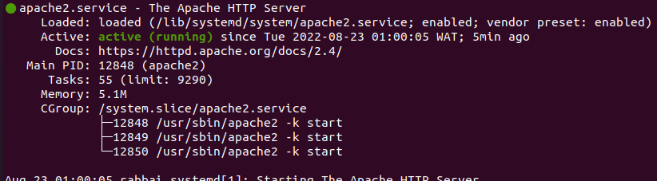

## Web stack implementation (LAMP stack) in aws
---
<br>

This shows a simple implementation of a **LAMP** web stack in aws.

> ### **STEP 0 — Create a virtual server with Ubuntu Server OS** 

```
Select your preferred region (the closest to you) and launch a new EC2 instance of t2.micro family with Ubuntu Server 20.04 LTS (HVM)
```


```
<!-- Connect to the EC2 instance via the terminal -->

# Run this line to avoid permission error
sudo chmod 0400 <private-key-name>.pem 
#Connect via SSH
ssh -i <private-key-name>.pem ubuntu@<Public-IP-address>

```


<br>

> ### **Step 1 — Installing Apache and Updating the Firewall** 

1. Install Apache using Ubuntu’s package manager ‘apt’
```
#update a list of packages in package manager
$ sudo apt update

#run apache2 package installation
$ sudo apt install apache2
```


2. Verify your installation by running the following command:
```
$ sudo systemctl status apache2
```


3. Add a new inbound rule to the EC2 Instance's firewall; this will allow the EC2 Instance to receive HTTP requests from the Internet.

4. Access the webserver locally in the Ubuntu shell and using the following URL:
```
 # Locally
 $ curl http://localhost:80
 # curl http://127.0.0.1:80
                                        
 # Given URL on the browser
 http://<Public-IP-Address>:80
```


> ### **Step 3 — Installing MYSQL** 

1. Install MySQL using the following commands:
```
$ sudo apt install mysql-server
```


2. Log in to the MySQL console by typing:
```
$ sudo mysql
```


3. You need to run security script 
that comes pre-installed with MySQL. This script will remove some insecure default settings and lock down access to your database system.<br><br>
Before running the script you will set a password for the root user, using mysql_native_password as default authentication method.

```
mysql> ALTER USER 'root'@'localhost' IDENTIFIED WITH mysql_native_password BY 'YourPassword';

mysql> exit
```
Then, run the script
```
sudo mysql_secure_installation
```
This will ask you to configure the validation plugin which helps with passsword strength check. If one wants it enabaled; answer Y to the prompt If not, press any other key.
<br>
<b> NOTE: Always use a strong password for MySQL. </b>

 

4. Test your MySQL installation by running the following command:
```
$ sudo mysql -p
```

Notice the -p flag in this command, which will prompt you for the password used after changing the root user password.

If installation is successful, you should see the following message:
 

<b>Note: At the time of this writing, the native MySQL PHP library mysqlnd doesn’t support caching_sha2_authentication, the default authentication method for MySQL 8. For that reason, when creating database users for PHP applications on MySQL 8, you’ll need to make sure they’re configured to use mysql_native_password instead.</b>

> ### **Step 4 — Installing PHP** 
To install these 3 packages at once, run:

    $ sudo apt install php libapache2-mod-php php-mysql

The command above will install the following:<br>
**PHP** is the component of our setup that will process code to display dynamic content to the end user.<br>
**php-mysql** a PHP module that allows PHP to communicate with MySQL-based databases.<br>
**libapache2-mod-php** to enable Apache to handle PHP files.

Once the installation is finished, you can run the following command to confirm your PHP version:

    php -v

> ### **Step 5 — Creating a Virtual Host for your Website using Apache**

In this project, you will set up a domain called projectlamp, but you can replace this with any domain of your choice.

*Apache on Ubuntu 20.04 has one server block enabled by default that is configured to serve documents from the /var/www/html directory.*

1. Create the directory for projectlamp using ‘mkdir’ command as follows:

```
$ sudo mkdir /var/www/projectlamp
```
2. Assign ownership of the directory with your current system user:

```
$ sudo chown -R $USER:$USER /var/www/projectlamp
```

  Then, create and open a new configuration file in Apache’s sites-available directory using your preferred command-line editor.
  
  ```
  $ sudo vi /etc/apache2/sites-available/projectlamp.conf
  ```

  Paste below code.
  
  ```
  <VirtualHost *:80>
    ServerName projectlamp
    ServerAlias www.projectlamp 
    ServerAdmin webmaster@localhost
    DocumentRoot /var/www/projectlamp
    ErrorLog ${APACHE_LOG_DIR}/error.log
    CustomLog ${APACHE_LOG_DIR}/access.log combined
</VirtualHost>
```

You can now use a2ensite command to enable the new virtual host:

```
sudo a2ensite projectlamp
```
You might want to disable the default website that comes installed with Apache. This is required if you’re not using a custom domain name, because in this case Apache’s default configuration would overwrite your virtual host. To disable Apache’s default website use a2dissite command , type:

```
sudo a2dissite 000-default
```

To make sure your configuration file doesn’t contain syntax errors, run:

```
sudo apache2ctl configtest
```

Finally, reload Apache so these changes take effect:

```
sudo systemctl reload apache2
```
Your new website is now active, but the web root /var/www/projectlamp is still empty. Create an index.html file in that location so that we can test that the virtual host works as expected:

```
sudo echo 'Hello LAMP from hostname' $(curl -s http://169.254.169.254/latest/meta-data/public-hostname) 'with public IP' $(curl -s http://169.254.169.254/latest/meta-data/public-ipv4) > /var/www/projectlamp/index.html
```
Now go to your browser and try to open your website URL using IP address:

```
http://<Public-IP-Address>:80 
```
> ### **Step 6 — Enable PHP on the website**
With the default DirectoryIndex settings on Apache, a file named index.html will always take precedence over an index.php file. 

Goto /etc/apache2/mods-enabled/dir.conf file and change the order in which the index.php file is listed within the DirectoryIndex directive:

```
sudo vim /etc/apache2/mods-enabled/dir.conf
```

```
<IfModule mod_dir.c>
        #Change this:
        #DirectoryIndex index.html index.cgi index.pl index.php index.xhtml index.htm
        #To this:
        DirectoryIndex index.php index.html index.cgi index.pl index.xhtml index.htm
</IfModule>
```

After saving and closing the file, you will need to reload Apache so the changes take effect:

```
sudo systemctl reload apache2
```

Create a new file named index.php inside your custom web root folder:

```
vim /var/www/projectlamp/index.php
```

This will open a blank file. Add the following text, which is valid PHP code, inside the file:

```
<?php
phpinfo();
```
When you are finished, save and close the file, refresh the page and you will see a page similar to this:
<br>


