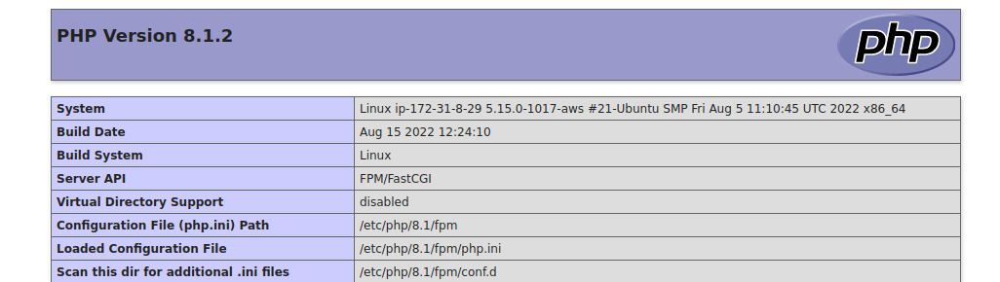

## Web stack implementation (LEMP stack) in aws
---
This project shows a simple implementation of a web stack in aws.
Note: The EC2 instance is not created here. It has been created in project1.
<br>

> ### **STEP 1 — Installing the NGINX Web Server**


1. Install Nginx using the following commands:

```
#update a list of packages in package manager
$ sudo apt update

#run Nginx package installation
$ sudo apt install nginx
```


2. Verify your installation by running the following command:

```
$ sudo systemctl status nginx
```


3. Add a new inbound rule to the EC2 Instance's firewall; this will allow the EC2 Instance to receive HTTP requests from the Internet.

4. Access the webserver locally in the Ubuntu shell and using the following URL:
```
 # Locally
 $ curl http://localhost:80
 # curl http://127.0.0.1:80
                                        
 # Get your public ip
 $ curl -s http://169.254.169.254/latest/meta-data/public-ipv4

 # Enter the public ip gotten from above on the browser.
 http://<Public-IP-Address>:80
```


> ### **Step 3 — Installing MYSQL** 

1. Install MySQL using the following commands:
```
$ sudo apt install mysql-server
```


2. Log in to the MySQL console by typing:
```
$ sudo mysql
```


3. You need to run security script 
that comes pre-installed with MySQL. This script will remove some insecure default settings and lock down access to your database system.<br><br>
Before running the script you will set a password for the root user, using mysql_native_password as default authentication method.

```
mysql> ALTER USER 'root'@'localhost' IDENTIFIED WITH mysql_native_password BY 'YourPassword';

mysql> exit
```
Then, run the script
```
$ sudo mysql_secure_installation
```
This will ask you to configure the validation plugin which helps with passsword strength check. If one wants it enabaled; answer Y to the prompt If not, press any other key.
<br>
<b> NOTE: Always use a strong password for MySQL. </b>

 

4. Test your MySQL installation by running the following command:
```
$ sudo mysql -p
```

Notice the -p flag in this command, which will prompt you for the password used after changing the root user password.

If installation is successful, you should see the following message:
 

<b>Note: At the time of this writing, the native MySQL PHP library mysqlnd doesn’t support caching_sha2_authentication, the default authentication method for MySQL 8. For that reason, when creating database users for PHP applications on MySQL 8, you’ll need to make sure they’re configured to use mysql_native_password instead.</b>

> ### **STEP 3 — Installing PHP**
To install the 3 required packages at once, run:
```
$ sudo apt install php-fpm php-mysql
```
The command above will install the following packages:
<br>PHP </br>
<br>php-fpm(PHP fastCGI process manager) to tell Nginx to pass PHP requests to this software for processing</br>
<br>php-mysql, a PHP module that allows PHP to communicate with MySQL-based databases.</br>

> ### **Step 4 — Configuring Nginx to Use PHP Processor**

To create a domain (e.g projectlemp) for an app we need to create a server blocks just like virtual host in Apache for the domain. This can be useful if we want to host more than one domain on the server.<br>

**Note: Nginx enables a sever block by default and its 
configured to serve documents in var/www/html directory. This is great if we are hosting just one website/application. But if we want to host more than one website/application, we need to create a server block for each website/application. In order to achive this,we’ll create a directory structure within /var/www for each website/application we are hosting on the server.
The server block in var/www/html will serve requests that doesnt match any other website.** <br>


1. Create the root web directory for projectlemp using ‘mkdir’ command as follows:

```
$ sudo mkdir /var/www/projectLEMP
```


2. Assign ownership of the directory to current user using ‘chown’ command as follows:

```
$ sudo chown -R $USER:$USER /var/www/projectLEMP
```
3. Create and open a new configuration file in Nginx's sites-available directory using nano editor command as follows:

```
$ sudo nano /etc/nginx/sites-available/projectLEMP
```

4. Add the following lines to the file:

```
#/etc/nginx/sites-available/projectLEMP

server {
    listen 80;
    server_name projectLEMP www.projectLEMP;
    root /var/www/projectLEMP;

    index index.html index.htm index.php;

    location / {
        try_files $uri $uri/ =404;
    }

    location ~ \.php$ {
        include snippets/fastcgi-php.conf;
        fastcgi_pass unix:/var/run/php/php7.4-fpm.sock;
     }

    location ~ /\.ht {
        deny all;
    }

}
```

Note the following:
<i>
<li>listen — Defines what port Nginx will listen on. In this case, it will listen on port 80, the default port for HTTP.</li>
<li>root — Defines the document root where the files served by this website are stored.</li>
<li>index — Defines in which order Nginx will prioritize index files for this website. It is a common practice to list index.html files with a higher precedence than index.php files to allow for quickly setting up a maintenance landing page in PHP applications. You can adjust these settings to better suit your application needs.</li>
<li>server_name — Defines which domain names and/or IP addresses this server block should respond for. <b>Point this directive to your server’s domain name or public IP address.</b></li>
<li>location / — The first location block includes a try_files directive, which checks for the existence of files or directories matching a URI request. If Nginx cannot find the appropriate resource, it will return a 404 error.</li>
<li> location ~ \.php$ — The second location block includes a fastcgi_pass directive, which tells Nginx to pass PHP requests to the PHP-FPM process manager. </li>
<li>location ~ /\.ht { — The third location block includes a deny all directive, which tells Nginx to deny all requests to files or directories that begin with a dot. This prevents Nginx from serving files or directories that are hidden or system-specific. 
</i>

5. Activate your configuration by linking to the config file from Nginx’s sites-enabled directory. This creates a symbolic link for the file projectLEMP at /etc/nginx/sites-enabled/

```
$ sudo ln -s /etc/nginx/sites-available/projectLEMP /etc/nginx/sites-enabled/
```

6. Test your configuration with the following command:
```
$ sudo nginx -t
```
7. Disable the default server block by removing the symbolic link from sites-enabled directory:

```
$ sudo unlink /etc/nginx/sites-enabled/default    
```
8. Restart Nginx using the following command:
```
sudo systemctl reload nginx
```
9. In order to access the website, we need to create an index.html file in the projectlamp directory and output a message.
```
$ sudo echo 'Hello LEMP from hostname' $(curl -s http://169.254.169.254/latest/meta-data/public-hostname) 'with public IP' $(curl -s http://169.254.169.254/latest/meta-data/public-ipv4) > /var/www/projectLEMP/index.html
```
10. Verify the website by visiting:
```
http://<Public-IP-Address>:80
```

> ### **STEP 5 – Testing PHP with NGINX**
<b>We need to test if our Nginx can transfer .php files to PHP processor</b>

To do this; we need to open a new file called info.php within your document root in your text editor:
```
sudo nano /var/www/projectLEMP/info.php
```
Then add the line of code below:
```
<?php phpinfo(); ?>
```

We can now access this file at:
```
http://server_domain_or_IP/info.php

```


After checking the relevant information about your PHP server through that page, it’s best to remove the file you created as it contains sensitive information about your PHP environment and your Ubuntu server. You can use rm to remove that file:
```
sudo rm /var/www/your_domain/info.php
```
<br>

> ### **STEP 6 – Retrieving data from MYSQL database with PHP**

We will create a database named example_database and a user named example_user, but you can replace these names with different values.

1. Create a new database named example_database using the following command:
```
CREATE DATABASE `example_database`;
```
2. Create a database User named example_user with the following command:
```
CREATE USER 'example_user'@'%' IDENTIFIED WITH mysql_native_password BY 'password';
```
The command above creates a new user named example_user, using mysql_native_password as default authentication method

3. Assign the user permission over the example_database database:
```
GRANT ALL PRIVILEGES ON `example_database`.* TO 'example_user'@'%';
```
4. Exit the MySQL shell and log back in as the example_user:
```
exit
```
5. Connect to the database using the following command:
```
mysql -u example_user -p    
```
6. Show the list of databases:
```
show databases;
```

7. Lets create a table named todo_list in the example_database database:
```
CREATE TABLE example_database.todo_list (
item_id INT AUTO_INCREMENT,
content VARCHAR(255),
PRIMARY KEY(item_id)
);
```
8. Insert some data into the table:
```
INSERT INTO example_database.todo_list (content) VALUES ('Buy milk');
INSERT INTO example_database.todo_list (content) VALUES ('Buy eggs');
INSERT INTO example_database.todo_list (content) VALUES ('Buy bread');
```
9. Check data in the example_database database:
```
SELECT * FROM example_database.todo_list;   
```
```
# Exit mysql console.
exit
```

10. Create a php script to display the data from the table:
```
sudo nano /var/www/projectlemp/todo_list.php
```
11. Add the following code to the file:
```
<?php
$user = "example_user";
$password = "password";
$database = "example_database";
$table = "todo_list";

try {
  $db = new PDO("mysql:host=localhost;dbname=$database", $user, $password);
  echo "<h2>TODO</h2><ol>";
  foreach($db->query("SELECT content FROM $table") as $row) {
    echo "<li>" . $row['content'] . "</li>";
  }
  echo "</ol>";
} catch (PDOException $e) {
    print "Error!: " . $e->getMessage() . "<br/>";
    die();
}
```

12. Test the php script by visiting:
```
http://server_domain_or_IP/todo_list.php
```


