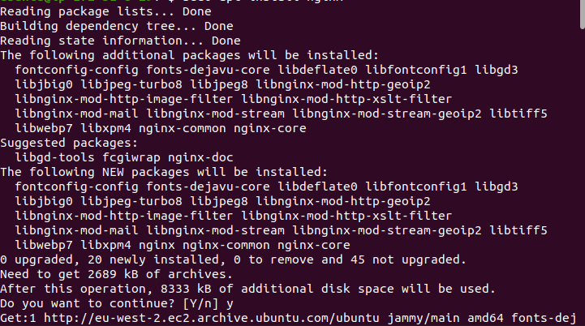
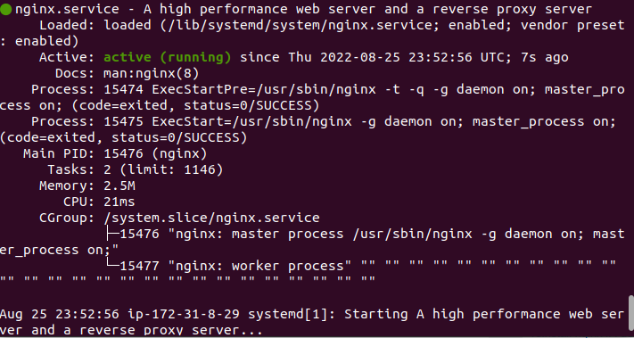
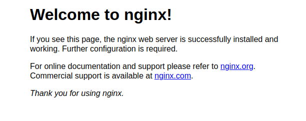
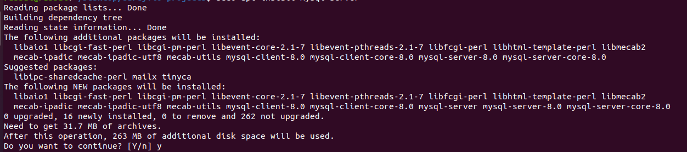
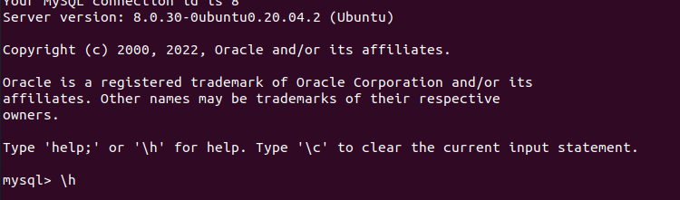
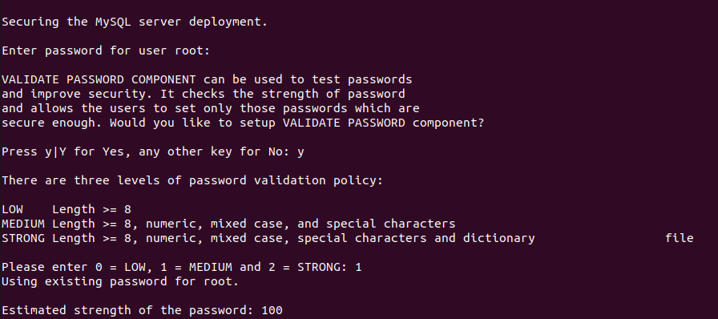
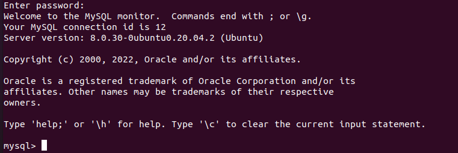

## Web stack implementation (LEMP stack) in aws
---
This project shows a simple implementation of a web stack in aws.
Note: The EC2 instance is not created here. It has been created in project1.
<br>

> ### **STEP 1 — Installing the NGINX Web Server**


1. Install Nginx using the following commands:

```
#update a list of packages in package manager
$ sudo apt update

#run Nginx package installation
$ sudo apt install nginx
```


2. Verify your installation by running the following command:

```
$ sudo systemctl status nginx
```


3. Add a new inbound rule to the EC2 Instance's firewall; this will allow the EC2 Instance to receive HTTP requests from the Internet.

4. Access the webserver locally in the Ubuntu shell and using the following URL:
```
 # Locally
 $ curl http://localhost:80
 # curl http://127.0.0.1:80
                                        
 # Get your public ip
 $ curl -s http://169.254.169.254/latest/meta-data/public-ipv4

 # Enter the public ip gotten from above on the browser.
 http://<Public-IP-Address>:80
```


> ### **Step 3 — Installing MYSQL** 

1. Install MySQL using the following commands:
```
$ sudo apt install mysql-server
```


2. Log in to the MySQL console by typing:
```
$ sudo mysql
```


3. You need to run security script 
that comes pre-installed with MySQL. This script will remove some insecure default settings and lock down access to your database system.<br><br>
Before running the script you will set a password for the root user, using mysql_native_password as default authentication method.

```
mysql> ALTER USER 'root'@'localhost' IDENTIFIED WITH mysql_native_password BY 'YourPassword';

mysql> exit
```
Then, run the script
```
$ sudo mysql_secure_installation
```
This will ask you to configure the validation plugin which helps with passsword strength check. If one wants it enabaled; answer Y to the prompt If not, press any other key.
<br>
<b> NOTE: Always use a strong password for MySQL. </b>

 

4. Test your MySQL installation by running the following command:
```
$ sudo mysql -p
```

Notice the -p flag in this command, which will prompt you for the password used after changing the root user password.

If installation is successful, you should see the following message:
 

<b>Note: At the time of this writing, the native MySQL PHP library mysqlnd doesn’t support caching_sha2_authentication, the default authentication method for MySQL 8. For that reason, when creating database users for PHP applications on MySQL 8, you’ll need to make sure they’re configured to use mysql_native_password instead.</b>

> ### **STEP 3 — Instaqlling PHP**
To install the 3 required packages at once, run:
```
$ sudo apt install php-fpm php-mysql
```
The command above will install the following packages:
<br>PHP </br>
<br>php-fpm(PHP fastCGI process manager) to tell Nginx to pass PHP requests to this software for processing</br>
<br>php-mysql, a PHP module that allows PHP to communicate with MySQL-based databases.</br>


