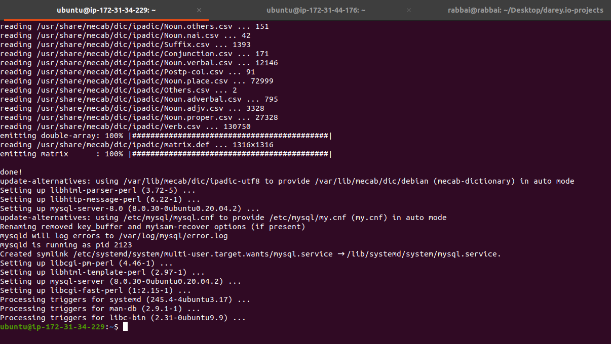
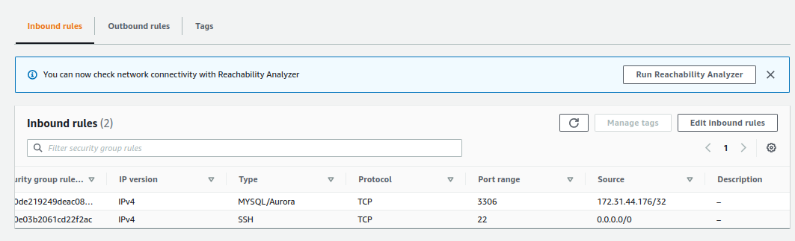
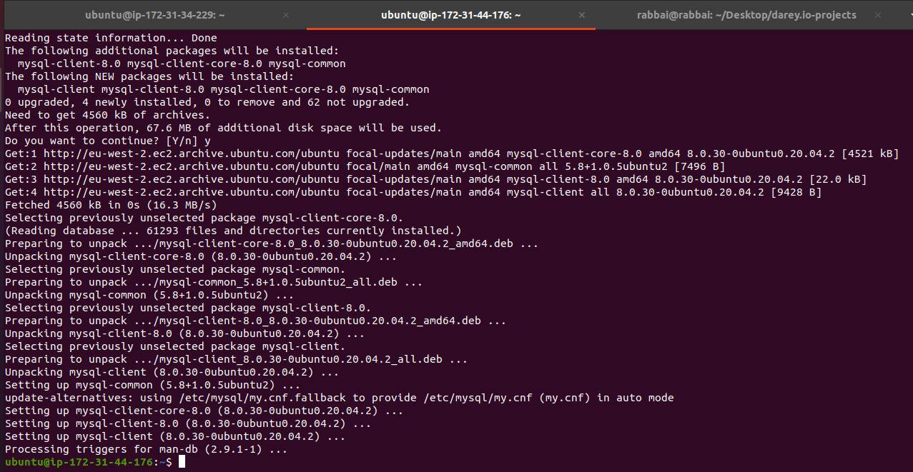
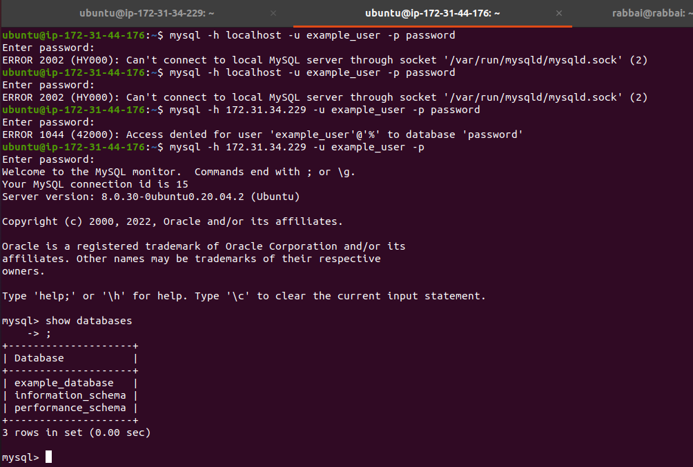

## Implement a Client Server Architecture using MySQL Database Management System (DBMS).
---
<br>


> ### **STEP 1 - Create and configure two Linux-based virtual servers**

1. Create two EC2 instances in AWS
```
Server A name - `mysql server`
Server B name - `mysql client`
```
2. On mysql server Linux Server install MySQL Server software. <br><br> 
MySQL server uses TCP port 3306 by default, so you will have to open it by creating a new entry in ‘Inbound rules’ in ‘mysql server’ Security Groups. For extra security, do not allow all IP addresses to reach your ‘mysql server’ – allow access only to the specific local IP address of your ‘mysql client’, ie allow access to 'mysql client' private IP addr.
```
sudo apt update
sudo apt install mysql-server
```





3. On mysql client Linux Server install MySQL Client software. 
```
sudo apt update
sudo apt install mysql-client
```



4. Edit MYSQL configuration file to allow remote access to MySQL server and replace 127.0.0.1 with 0.0.0.0.
```
sudo vi /etc/mysql/mysql.conf.d/mysqld.cnf
```
5. Restart MySQL server.
```
sudo service mysql restart
```
6. Create a new user and database for the project.
```
mysql -u root -p
mysql> CREATE DATABASE `example_database`;

mysql> CREATE USER 'example_user'@'%' IDENTIFIED WITH mysql_native_password BY 'password';

mysql> GRANT ALL PRIVILEGES ON `example_database`.* TO 'example_user'@'%';

mysql> exit
```
> ### **STEP 2: Connecting to the MySQL Server on mysql-server from the client on the client-server**

    1. Connect to the MySQL server using the following command:
```
mysql -h 54.221.33.123 -u example_user -p
```




